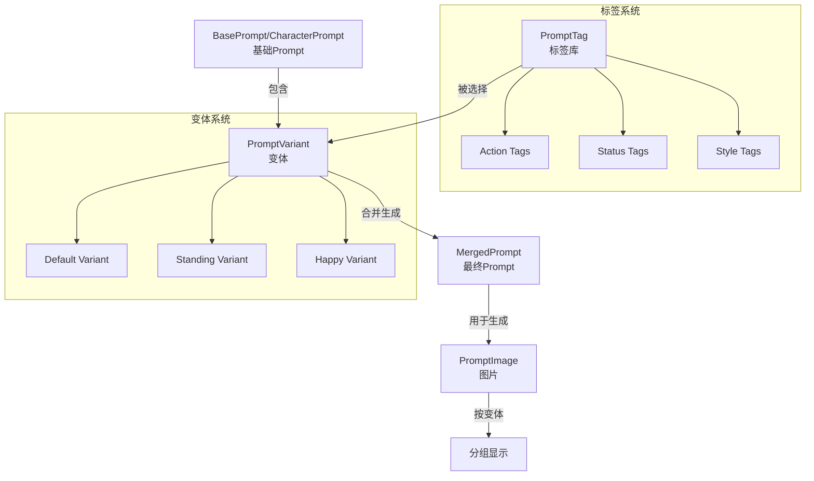

# Prompt 标签化和变体系统重构方案

## 一、系统架构设计

### 1.1 核心概念

```
标签 Prompt 系统 (PromptTag)
  ↓ 提供可复用的标签内容
变体系统 (PromptVariant)
  ↓ 选择标签组合，生成最终 Prompt
图片生成
  ↓ 关联到变体
图片分组显示
```

### 1.2 数据流



## 二、数据库结构设计

### 2.1 新增表：PromptTag（标签 Prompt）

**文件**: `apps/backend/prisma/schema.prisma`

```prisma
model PromptTag {
  id          Int      @id @default(autoincrement())
  name        String   // 标签名称，如 "anime", "standing", "happy"
  tagType     String   // 标签类型: "action" | "status" | "style" | "appearance" | "personality"
  content     String   @db.Text // Prompt 内容
  description String?  // 描述
  order       Int      @default(0) // 排序权重
  enabled     Boolean  @default(true)
  createdAt   DateTime @default(now())
  updatedAt   DateTime @updatedAt

  @@index([tagType])
  @@index([enabled])
  @@map("prompt_tags")
}
```

### 2.2 新增表：PromptVariant（变体）

**文件**: `apps/backend/prisma/schema.prisma`

```prisma
model PromptVariant {
  id                Int      @id @default(autoincrement())
  name              String   // 变体名称，如 "Default", "Standing Pose"
  description       String?  // 变体描述
  isDefault         Boolean  @default(false) // 是否为默认变体
  
  // 关联到 BasePrompt 或 CharacterPrompt（二选一）
  basePromptId      Int?
  characterPromptId Int?
  
  // 标签ID数组和顺序（JSON格式）
  // 格式: [{"tagId": 1, "order": 0}, {"tagId": 3, "order": 1}]
  tagIds            Json     @default("[]")
  
  // 合并后的最终 Prompt（缓存）
  mergedPrompt      String   @db.Text
  
  // 合并配置（JSON）
  // 格式: {"separator": "\n", "prefix": "", "suffix": ""}
  mergeConfig       Json?    @default("{\"separator\": \"\\n\"}")
  
  order             Int      @default(0) // 排序
  enabled           Boolean  @default(true)
  
  createdAt         DateTime @default(now())
  updatedAt         DateTime @updatedAt
  
  // 关联
  basePrompt        BasePrompt?      @relation(fields: [basePromptId], references: [id], onDelete: Cascade)
  characterPrompt   CharacterPrompt? @relation(fields: [characterPromptId], references: [id], onDelete: Cascade)
  images            PromptImage[]
  
  @@index([basePromptId])
  @@index([characterPromptId])
  @@index([isDefault])
  @@map("prompt_variants")
}
```

### 2.3 修改现有表

#### 修改 BasePrompt 和 CharacterPrompt

**文件**: `apps/backend/prisma/schema.prisma`

- 将 `prompt` 字段重命名为 `basicPrompt`（基础 Prompt）
- 添加关联到 `PromptVariant`
```prisma
model BasePrompt {
  // ... 现有字段 ...
  basicPrompt       String   @db.Text // 原 prompt 字段，重命名
  // ... 其他字段 ...
  
  variants          PromptVariant[] // 新增关联
}

model CharacterPrompt {
  // ... 现有字段 ...
  basicPrompt       String   @db.Text // 原 prompt 字段，重命名
  // ... 其他字段 ...
  
  variants          PromptVariant[] // 新增关联
}
```


#### 修改 PromptImage

**文件**: `apps/backend/prisma/schema.prisma`

- 添加 `variantId` 字段，关联到 `PromptVariant`
- 保留原有的 `basePromptId` 和 `characterPromptId` 用于兼容
```prisma
model PromptImage {
  // ... 现有字段 ...
  variantId         Int?     // 新增：关联到变体
  variant           PromptVariant? @relation(fields: [variantId], references: [id], onDelete: SetNull)
  
  @@index([variantId])
}
```


## 三、后端实现

### 3.1 类型定义

**文件**: `packages/shared/src/types/prompt.ts`

新增类型：

```typescript
// 标签 Prompt
export interface PromptTag {
  id: number;
  name: string;
  tagType: 'action' | 'status' | 'style' | 'appearance' | 'personality';
  content: string;
  description?: string;
  order: number;
  enabled: boolean;
  createdAt: Date;
  updatedAt: Date;
}

// 变体标签项
export interface VariantTagItem {
  tagId: number;
  order: number;
}

// Prompt 变体
export interface PromptVariant {
  id: number;
  name: string;
  description?: string;
  isDefault: boolean;
  basePromptId?: number;
  characterPromptId?: number;
  tagIds: VariantTagItem[]; // JSON 解析后的数组
  mergedPrompt: string;
  mergeConfig?: {
    separator?: string;
    prefix?: string;
    suffix?: string;
  };
  order: number;
  enabled: boolean;
  createdAt: Date;
  updatedAt: Date;
}

// DTOs
export interface CreatePromptTagDto {
  name: string;
  tagType: string;
  content: string;
  description?: string;
  order?: number;
}

export interface UpdatePromptTagDto {
  name?: string;
  tagType?: string;
  content?: string;
  description?: string;
  order?: number;
  enabled?: boolean;
}

export interface CreatePromptVariantDto {
  name: string;
  description?: string;
  basePromptId?: number;
  characterPromptId?: number;
  tagIds: VariantTagItem[];
  mergeConfig?: {
    separator?: string;
    prefix?: string;
    suffix?: string;
  };
  order?: number;
}

export interface UpdatePromptVariantDto {
  name?: string;
  description?: string;
  tagIds?: VariantTagItem[];
  mergeConfig?: {
    separator?: string;
    prefix?: string;
    suffix?: string;
  };
  order?: number;
  enabled?: boolean;
}

// 修改现有 DTO
export interface CreateBasePromptDto {
  name: string;
  basicPrompt: string; // 原 prompt 字段
  // ... 其他字段
}

export interface UpdateBasePromptDto {
  name?: string;
  basicPrompt?: string; // 原 prompt 字段
  // ... 其他字段
}
```

### 3.2 Service 层

**文件**: `apps/backend/src/modules/prompts/prompts.service.ts`

#### 标签 Prompt 服务方法

```typescript
// 标签 CRUD
async findAllTags(tagType?: string): Promise<PromptTag[]>
async findTagById(id: number): Promise<PromptTag>
async createTag(dto: CreatePromptTagDto): Promise<PromptTag>
async updateTag(id: number, dto: UpdatePromptTagDto): Promise<PromptTag>
async deleteTag(id: number): Promise<void>
```

#### 变体服务方法

```typescript
// 变体 CRUD
async findVariantsByPrompt(promptId: number, type: 'base' | 'character'): Promise<PromptVariant[]>
async findVariantById(id: number): Promise<PromptVariant>
async createVariant(dto: CreatePromptVariantDto): Promise<PromptVariant>
async updateVariant(id: number, dto: UpdatePromptVariantDto): Promise<PromptVariant>
async deleteVariant(id: number): Promise<void>
async setDefaultVariant(id: number): Promise<PromptVariant>

// 合并 Prompt
async mergeVariantPrompt(variantId: number): Promise<string>
async mergePrompt(
  basicPrompt: string,
  tagIds: VariantTagItem[]
): Promise<string>
```

#### 合并逻辑实现

```typescript
private async mergePrompt(
  basicPrompt: string,
  tagIds: VariantTagItem[],
  mergeConfig?: { separator?: string; prefix?: string; suffix?: string }
): Promise<string> {
  // 1. 按 order 排序标签
  const sortedTags = tagIds.sort((a, b) => a.order - b.order);
  
  // 2. 获取标签内容
  const tagContents = await Promise.all(
    sortedTags.map(item => 
      this.prisma.promptTag.findUnique({ where: { id: item.tagId } })
    )
  );
  
  // 3. 过滤启用的标签
  const enabledTags = tagContents
    .filter(tag => tag && tag.enabled)
    .map(tag => tag!.content);
  
  // 4. 合并
  const separator = mergeConfig?.separator || '\n';
  const parts = [basicPrompt, ...enabledTags].filter(Boolean);
  return parts.join(separator);
}
```

### 3.3 Controller 层

**文件**: `apps/backend/src/modules/prompts/prompts.controller.ts`

#### 标签 Prompt API

```typescript
@Get('tags')
async findAllTags(@Query('tagType') tagType?: string)

@Get('tags/:id')
async findTagById(@Param('id', ParseIntPipe) id: number)

@Post('tags')
async createTag(@Body() dto: CreatePromptTagDto)

@Put('tags/:id')
async updateTag(@Param('id', ParseIntPipe) id: number, @Body() dto: UpdatePromptTagDto)

@Delete('tags/:id')
async deleteTag(@Param('id', ParseIntPipe) id: number)
```

#### 变体 API

```typescript
@Get('variants')
async findVariants(
  @Query('basePromptId') basePromptId?: number,
  @Query('characterPromptId') characterPromptId?: number
)

@Get('variants/:id')
async findVariantById(@Param('id', ParseIntPipe) id: number)

@Post('variants')
async createVariant(@Body() dto: CreatePromptVariantDto)

@Put('variants/:id')
async updateVariant(@Param('id', ParseIntPipe) id: number, @Body() dto: UpdatePromptVariantDto)

@Delete('variants/:id')
async deleteVariant(@Param('id', ParseIntPipe) id: number)

@Post('variants/:id/set-default')
async setDefaultVariant(@Param('id', ParseIntPipe) id: number)

@Post('variants/:id/merge')
async mergeVariant(@Param('id', ParseIntPipe) id: number)
```

#### 修改图片 API

修改图片上传接口，支持指定 `variantId`：

```typescript
@Post('images')
async uploadImages(
  @Body() body: { variantId?: number; basePromptId?: number; characterPromptId?: number },
  @UploadedFiles() files: Express.Multer.File[]
)
```

### 3.4 图片分组查询

**文件**: `apps/backend/src/modules/prompts/prompts.service.ts`

```typescript
async findImagesGroupedByVariant(
  basePromptId?: number,
  characterPromptId?: number
): Promise<{
  variants: Array<{
    id: number;
    name: string;
    isDefault: boolean;
    imageCount: number;
    images: PromptImageResponseDto[];
  }>;
  uncategorized: {
    imageCount: number;
    images: PromptImageResponseDto[];
  };
}>
```

## 四、前端实现

### 4.1 标签 Prompt 管理页面

**文件**: `apps/admin/src/pages/prompt-tags.tsx` (新建)

功能：

- 标签列表（按 tagType 分组显示）
- 创建/编辑/删除标签
- 标签类型筛选
- 标签排序

UI 布局：

```
┌─────────────────────────────────────┐
│ 标签 Prompt 管理                    │
├─────────────────────────────────────┤
│ 筛选: [全部] [Action] [Status] [...] │
│ [+ 新建标签]                        │
├─────────────────────────────────────┤
│ Action Tags                         │
│ ┌─────────┐ ┌─────────┐            │
│ │ standing│ │ sitting │            │
│ └─────────┘ └─────────┘            │
│                                      │
│ Status Tags                         │
│ ┌─────────┐ ┌─────────┐            │
│ │  happy  │ │   sad   │            │
│ └─────────┘ └─────────┘            │
└─────────────────────────────────────┘
```

### 4.2 重构 Prompt 编辑表单

**文件**: `apps/admin/src/components/features/base-prompt-form.tsx`

**文件**: `apps/admin/src/components/features/character-prompt-form.tsx`

重构为标签页布局：

```
┌─────────────────────────────────────┐
│ [基础 Prompt] [变体管理] [设置]     │
├─────────────────────────────────────┤
│ 基础 Prompt                          │
│ [文本编辑器 - basicPrompt]          │
└─────────────────────────────────────┘

┌─────────────────────────────────────┐
│ 变体管理                             │
│ ┌─────────────────────────────────┐ │
│ │ [Default] [Standing] [+ 新建]   │ │
│ └─────────────────────────────────┘ │
│                                      │
│ 当前变体: "Default"                  │
│ ┌─────────────────────────────────┐ │
│ │ 标签选择:                        │ │
│ │ ☑ Style: anime                  │ │
│ │ ☐ Action: standing              │ │
│ │ [+ 添加标签]                    │ │
│ └─────────────────────────────────┘ │
│                                      │
│ 合并预览:                            │
│ ┌─────────────────────────────────┐ │
│ │ [只读，实时显示]                 │ │
│ └─────────────────────────────────┘ │
└─────────────────────────────────────┘
```

### 4.3 图片集合页面重构

**文件**: `apps/admin/src/pages/prompts.tsx`

修改图片显示部分，按变体分组：

```typescript
// 数据结构
interface VariantGroup {
  id: number;
  name: string;
  isDefault: boolean;
  imageCount: number;
  images: PromptImageResponseDto[];
}

// UI 布局
┌─────────────────────────────────────┐
│ 图片集合 - Character A               │
│ 变体筛选: [全部] [Default] [...]     │
├─────────────────────────────────────┤
│ ▼ Default (5 张)                    │
│ [图片网格]                           │
│                                      │
│ ▼ Standing Pose (3 张)              │
│ [图片网格]                           │
│                                      │
│ ▼ Happy Status (2 张)                │
│ [图片网格]                           │
└─────────────────────────────────────┘
```

### 4.4 API Hooks

**文件**: `apps/admin/src/lib/hooks/use-prompts.ts`

新增 hooks：

```typescript
// 标签 Prompt
export function usePromptTags(tagType?: string)
export function usePromptTag(id: number)
export function useCreatePromptTag()
export function useUpdatePromptTag()
export function useDeletePromptTag()

// 变体
export function usePromptVariants(basePromptId?: number, characterPromptId?: number)
export function usePromptVariant(id: number)
export function useCreatePromptVariant()
export function useUpdatePromptVariant()
export function useDeletePromptVariant()
export function useSetDefaultVariant()
export function useMergeVariant()

// 图片分组
export function usePromptImagesGrouped(basePromptId?: number, characterPromptId?: number)
```

## 五、数据迁移策略

### 5.1 数据库迁移

**文件**: `apps/backend/prisma/migrations/XXXXXX_add_prompt_tags_and_variants/migration.sql`

迁移步骤：

1. 创建 `prompt_tags` 表
2. 创建 `prompt_variants` 表
3. 修改 `base_prompts` 表：`prompt` → `basic_prompt`
4. 修改 `character_prompts` 表：`prompt` → `basic_prompt`
5. 修改 `prompt_images` 表：添加 `variant_id` 字段
6. 为每个现有的 BasePrompt/CharacterPrompt 创建默认变体：

   - 变体名称：`"Default"`
   - `isDefault: true`
   - `tagIds: []`
   - `mergedPrompt`: 使用现有的 `prompt` 值

### 5.2 数据兼容性

- 保留原有的 `basePromptId` 和 `characterPromptId` 字段
- 图片如果没有 `variantId`，显示在"未分类"分组
- 逐步迁移：新生成的图片必须关联变体

## 六、实现步骤

### Phase 1: 数据库和类型定义

1. 创建 Prisma migration
2. 更新 shared types
3. 运行 migration

### Phase 2: 后端 API - 标签系统

1. 实现 PromptTag Service
2. 实现 PromptTag Controller
3. 添加 API 路由

### Phase 3: 后端 API - 变体系统

1. 实现 PromptVariant Service（包含合并逻辑）
2. 实现 PromptVariant Controller
3. 修改图片上传接口支持 variantId

### Phase 4: 前端 - 标签管理

1. 创建标签管理页面
2. 实现标签 CRUD UI
3. 添加路由和菜单

### Phase 5: 前端 - Prompt 编辑重构

1. 重构 BasePromptForm（支持变体管理）
2. 重构 CharacterPromptForm（支持变体管理）
3. 实现标签选择器组件
4. 实现实时预览功能

### Phase 6: 前端 - 图片分组显示

1. 修改图片查询 API hooks
2. 重构图片集合 UI（按变体分组）
3. 添加变体筛选功能

### Phase 7: 测试和优化

1. 端到端测试
2. UI/UX 优化
3. 性能优化（合并结果缓存）

## 七、关键设计决策

1. **使用 JSON 存储标签ID数组**：简化关联，避免额外的关联表
2. **合并结果缓存**：`mergedPrompt` 字段缓存合并结果，提高性能
3. **默认变体机制**：每个 Prompt 必须有一个 Default 变体
4. **向后兼容**：保留原有字段，支持渐进式迁移
5. **实时预览**：前端实时调用合并 API，显示最终 Prompt

## 八、文件清单

### 新增文件

- `apps/admin/src/pages/prompt-tags.tsx` - 标签管理页面
- `apps/admin/src/components/features/prompt-tag-form.tsx` - 标签表单组件
- `apps/admin/src/components/features/prompt-variant-manager.tsx` - 变体管理组件
- `apps/admin/src/components/features/tag-selector.tsx` - 标签选择器组件

### 修改文件

- `apps/backend/prisma/schema.prisma` - 数据库模型
- `packages/shared/src/types/prompt.ts` - 类型定义
- `apps/backend/src/modules/prompts/prompts.service.ts` - Service 层
- `apps/backend/src/modules/prompts/prompts.controller.ts` - Controller 层
- `apps/admin/src/components/features/base-prompt-form.tsx` - Base Prompt 表单
- `apps/admin/src/components/features/character-prompt-form.tsx` - Character Prompt 表单
- `apps/admin/src/pages/prompts.tsx` - Prompt 管理页面
- `apps/admin/src/lib/hooks/use-prompts.ts` - API Hooks
- `apps/admin/src/lib/api/client.ts` - API 客户端
- `apps/admin/src/routes/config.tsx` - 路由配置
- `apps/admin/src/config/menu.ts` - 菜单配置