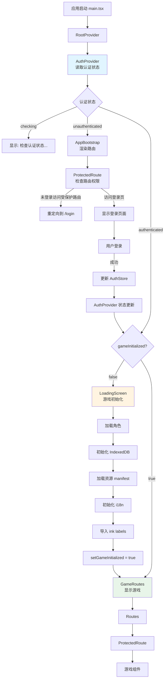
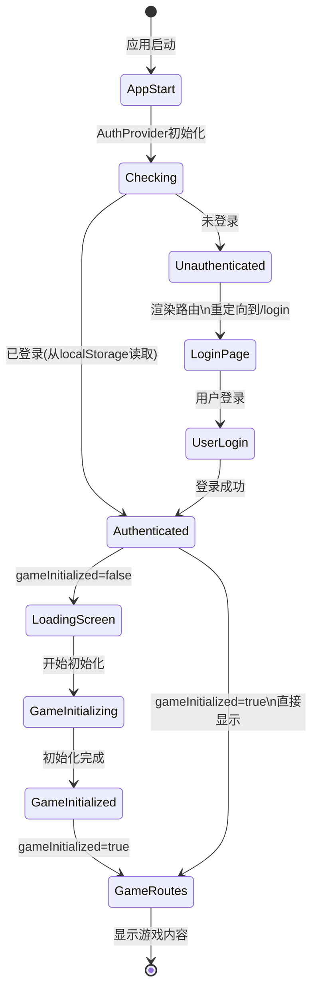
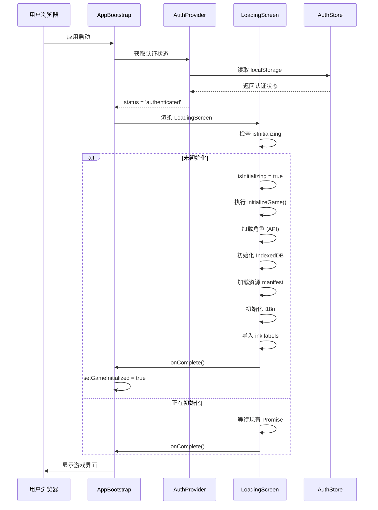

# 认证与路由流程文档

本文档详细说明应用的认证检查、路由保护和游戏初始化流程。

## 资源缓存机制

应用实现了智能的资源缓存机制，避免重复加载已加载的资源：

- **资源状态追踪**：使用 `ResourceCacheManager` 追踪每个资源的加载状态
- **持久化存储**：资源状态保存在 localStorage 中，页面刷新后仍然有效
- **内存验证**：检查内存中的实际状态（如 i18n.isInitialized、Assets.resolver）
- **跳过已加载资源**：如果资源已加载，直接跳过，大幅提升启动速度

**可缓存的资源类型**：
1. 角色数据（从 API 加载）
2. IndexedDB 初始化
3. Assets 初始化和 bundle 加载
4. i18n 初始化
5. Ink labels 导入

## 架构概览

应用采用分层架构，从顶层到底层：

```
App (main.tsx)
  └─> RootProvider (providers/RootProvider.tsx)
      ├─> BrowserRouter (路由提供者)
      ├─> MyThemeProvider (主题提供者)
      ├─> SnackbarProvider (通知提供者)
      └─> AuthProvider (providers/AuthProvider.tsx) ← 单一认证状态源
          └─> Home (Home.tsx)
              └─> AppBootstrap (应用启动引导)
                  ├─> LoadingScreen (游戏初始化)
                  └─> GameRoutes (游戏路由)
                      └─> AppRoutes (路由配置)
                          └─> ProtectedRoute (路由守卫)
```

## 核心组件说明

### 1. AuthProvider (`providers/AuthProvider.tsx`)

**职责**：单一认证状态源，统一管理认证状态

**状态**：
- `status`: `'checking' | 'authenticated' | 'unauthenticated'`
- `isAuthenticated`: boolean
- `user`: User | null

**初始化逻辑**：
- 组件挂载时，从 zustand store 读取初始认证状态（store 在创建时已从 localStorage 读取）
- 直接设置为正确状态，避免从 'checking' 到 'unauthenticated' 的过渡
- 监听 zustand store 的 `isAuthenticated` 变化，同步更新 `status`

### 2. AppBootstrap (`Home.tsx`)

**职责**：应用启动引导，根据认证状态决定渲染内容

**流程**：
1. 从 `AuthProvider` 获取认证状态
2. 根据状态渲染相应内容：
   - `status === 'checking'` → 显示"检查认证状态..."
   - `status === 'unauthenticated'` → 显示路由（会重定向到登录页）
   - `status === 'authenticated' && !gameInitialized` → 显示 LoadingScreen
   - `status === 'authenticated' && gameInitialized` → 显示 GameRoutes

**重定向逻辑**：
- 已认证用户访问 `/login` → 重定向到 `/`
- 未认证用户访问其他页面 → 重定向到 `/login`

### 3. LoadingScreen (`screens/LoadingScreen.tsx`)

**职责**：游戏资源初始化

**防重复初始化机制**：
- 使用模块级变量 `isInitializing` 和 `initializationPromise`
- 如果正在初始化，后续组件实例会等待同一个 Promise
- 初始化完成后，后续组件直接调用 `onComplete`

**初始化步骤**：
1. 导入 values 和 labels
2. 加载角色（从 API）
3. 初始化 IndexedDB
4. 加载资源 manifest
5. 初始化 i18n
6. 导入所有 ink labels

### 4. ProtectedRoute (`components/ProtectedRoute.tsx`)

**职责**：路由守卫，保护需要认证的路由

**逻辑**：
- 从 `AuthProvider` 读取认证状态（不自己管理状态）
- 如果 `requireAuth && !isAuthenticated` → 重定向到 `/login`
- 否则渲染 children

### 5. AuthStore (`stores/auth-store.ts`)

**职责**：认证状态存储（使用 zustand）

**初始化**：
- Store 创建时，从 localStorage 读取 `accessToken` 和 `user`
- 如果存在且有效，设置 `isAuthenticated = true`
- 这是同步操作，确保应用启动时立即知道认证状态

## 完整流程

### 场景 1：应用启动（未登录）

```
1. 应用启动
   └─> RootProvider 创建
       └─> AuthProvider 创建
           └─> 从 zustand store 读取认证状态
               └─> localStorage 中没有 token/user
                   └─> status = 'unauthenticated'

2. AppBootstrap 渲染
   └─> status === 'unauthenticated'
       └─> 检查 location.pathname
           ├─> 如果是 '/login' → 渲染 Routes（显示登录页）
           └─> 如果不是 → 重定向到 '/login'

3. 用户看到登录页面
```

### 场景 2：应用启动（已登录）

```
1. 应用启动
   └─> RootProvider 创建
       └─> AuthProvider 创建
           └─> 从 zustand store 读取认证状态
               └─> localStorage 中有有效的 token/user
                   └─> status = 'authenticated' (直接设置，无过渡)

2. AppBootstrap 渲染
   └─> status === 'authenticated' && gameInitialized === false
       └─> 渲染 LoadingScreen

3. LoadingScreen 初始化
   └─> 检查 isInitializing
       ├─> false → 开始初始化
       │   └─> isInitializing = true
       │   └─> 保存 initializationPromise
       │   └─> 执行 initializeGame()
       │       ├─> 加载角色
       │       ├─> 初始化 IndexedDB
       │       ├─> 加载资源 manifest
       │       ├─> 初始化 i18n
       │       └─> 导入 ink labels
       │   └─> 完成后调用 onComplete()
       │       └─> setGameInitialized(true)
       └─> true → 等待现有的 initializationPromise

4. 初始化完成
   └─> AppBootstrap 重新渲染
       └─> status === 'authenticated' && gameInitialized === true
           └─> 渲染 GameRoutes
               └─> 渲染 Routes（显示主菜单或其他页面）
```

### 场景 3：用户登录

```
1. 用户在登录页输入账号密码
   └─> 点击登录按钮
       └─> 调用 emailLogin()
           └─> API 请求
               └─> 成功返回 token 和 user
                   └─> 保存到 localStorage
                   └─> 更新 zustand store
                       └─> isAuthenticated = true

2. AuthProvider 监听到状态变化
   └─> status = 'authenticated'

3. AppBootstrap 重新渲染
   └─> status === 'authenticated' && gameInitialized === false
       └─> 渲染 LoadingScreen
           └─> 开始初始化游戏（同场景 2）

4. 初始化完成
   └─> 显示游戏主菜单
```

### 场景 4：已登录用户刷新页面

```
1. 页面刷新
   └─> 模块重新加载
       └─> isInitializing = false (重置)
       └─> initializationPromise = null (重置)

2. AuthProvider 初始化
   └─> 从 localStorage 读取认证状态
       └─> status = 'authenticated' (直接设置)

3. AppBootstrap 渲染
   └─> status === 'authenticated' && gameInitialized === false
       └─> 渲染 LoadingScreen
           └─> 开始初始化游戏（重新初始化是正常的）

4. 初始化完成
   └─> 显示游戏主菜单
```

### 场景 5：访问受保护的路由（未登录）

```
1. 用户访问 '/'
   └─> Routes 匹配到 MAIN_MENU_ROUTE
       └─> 渲染 ProtectedRoute
           └─> requireAuth = true

2. ProtectedRoute 检查
   └─> status === 'unauthenticated'
       └─> 重定向到 '/login'

3. 同时 AppBootstrap 也检查
   └─> status === 'unauthenticated' && location.pathname !== '/login'
       └─> 重定向到 '/login'

4. 用户看到登录页面
```

### 场景 6：已登录用户访问登录页

```
1. 用户访问 '/login'
   └─> Routes 匹配到 LOGIN_ROUTE
       └─> 渲染 UserLogin 组件

2. UserLogin 检查
   └─> status === 'authenticated'
       └─> 重定向到 '/'

3. 同时 AppBootstrap 也检查
   └─> status === 'authenticated' && location.pathname === '/login'
       └─> 重定向到 '/'

4. 用户看到主菜单
```

## 关键设计决策

### 1. 单一数据源

- **AuthProvider** 是唯一的认证状态源
- 所有组件都从 AuthProvider 读取认证状态
- 避免多个组件各自检查认证导致的状态不一致

### 2. 状态初始化优化

- AuthProvider 初始化时直接读取正确的状态，避免 `'checking' → 'unauthenticated' → 'authenticated'` 的过渡
- 这避免了登录后先跳到登录页再跳回首页的问题

### 3. 防重复初始化

- 使用模块级变量追踪初始化状态
- 多个组件实例共享同一个初始化 Promise
- 确保整个应用生命周期中只初始化一次

### 4. 双重重定向保护

- AppBootstrap 在应用层面处理重定向
- ProtectedRoute 在路由层面处理重定向
- 双重保护确保用户不会访问到不该访问的页面

### 5. 清晰的职责分离

- **AuthProvider**: 管理认证状态
- **AppBootstrap**: 管理应用启动流程
- **LoadingScreen**: 管理游戏初始化
- **ProtectedRoute**: 管理路由保护

每个组件职责单一，便于维护和测试。

## 数据流图



## 状态转换图



## 时序图



## 资源缓存机制

应用实现了智能的资源缓存机制，避免重复加载已加载的资源，大幅提升应用性能。

### ResourceCacheManager (`src/utils/resource-cache.ts`)

**职责**：统一管理所有游戏资源的加载状态

**工作原理**：
1. **状态存储**：
   - 内存中维护当前加载状态
   - localStorage 中持久化状态（key: `game_resource_cache_state`）
   - 页面刷新后从 localStorage 恢复状态

2. **资源检查**：
   - 每个资源都有对应的检查方法（如 `isCharactersLoaded()`）
   - 同时验证内存中的实际状态（如 `i18n.isInitialized`）
   - 双重验证确保状态准确

3. **资源标记**：
   - 资源加载成功后调用对应的 `mark*()` 方法
   - 自动保存到 localStorage

### 可缓存的资源类型

1. **角色数据** (`isCharactersLoaded`)
   - 从 API 加载的角色列表
   - 检查方式：缓存状态 + RegisteredCharacters 检查

2. **IndexedDB** (`isIndexedDBInitialized`)
   - 数据库初始化状态
   - 检查方式：缓存状态

3. **Assets** (`isAssetsInitialized`)
   - Assets 系统初始化
   - Bundle 加载状态（每个 bundle 单独追踪）
   - 检查方式：缓存状态 + Assets 内部状态

4. **i18n** (`isI18nInitialized`)
   - 国际化系统初始化
   - 检查方式：缓存状态 + `i18n.isInitialized`

5. **Ink Labels** (`isInkLabelsImported`)
   - Ink 文本标签导入
   - 检查方式：缓存状态

### 资源加载流程（带缓存）

```
initializeGame() 调用
  ↓
检查 isAllResourcesLoaded()
  ├─ 是 → 直接返回（跳过所有初始化）
  └─ 否 → 逐一检查每个资源
      ├─ 角色 → 已加载？跳过 : 加载并标记
      ├─ IndexedDB → 已初始化？跳过 : 初始化并标记
      ├─ Assets → 已初始化？只更新 manifest : 初始化并标记
      ├─ Bundle → 已加载？跳过 : 加载并标记
      ├─ i18n → 已初始化？跳过 : 初始化并标记
      └─ Ink Labels → 已导入？跳过 : 导入并标记
  ↓
所有资源加载完成
```

### 缓存生命周期

- **首次加载**：正常加载所有资源，完成后标记到缓存
- **页面刷新**：从 localStorage 恢复状态，仅加载未缓存的资源
- **手动清除**：调用 `resourceCache.clearCache()` 或 `reinitializeGame()` 强制重新加载

### 性能优化效果

- **首次启动**：正常加载时间
- **刷新页面**：仅加载未缓存资源，加载时间大幅减少
- **资源更新**：可手动清除缓存，强制重新加载最新资源

## 常见问题

### Q1: 为什么初始化会被调用两次？

**A**: 如果出现这种情况，可能原因：
1. React 严格模式在开发环境下会故意执行两次（这是正常的）
2. 组件重新挂载导致 useEffect 重新执行

**解决方案**：
- 使用模块级变量 `isInitializing` 和 `initializationPromise` 防止重复初始化
- 使用 `ResourceCacheManager` 追踪资源状态，已加载的资源会自动跳过

### Q2: 为什么登录后先跳到登录页再跳回首页？

**A**: 这通常是因为状态初始化时有一个过渡过程：
- `status: 'checking' → 'unauthenticated' → 'authenticated'`

**解决方案**：AuthProvider 初始化时直接读取正确的状态，避免不必要的过渡。

### Q3: 刷新页面后需要重新初始化游戏吗？

**A**: 不需要全部重新初始化。应用现在使用资源缓存机制：
- 已加载的资源会从缓存中恢复，不会重复加载
- 只有未缓存的资源才会重新加载
- 这样可以大幅减少刷新后的加载时间

### Q4: 如何强制重新加载所有资源？

**A**: 调用 `reinitializeGame()` 函数，它会：
1. 清除所有资源缓存状态
2. 重新执行完整的初始化流程

```typescript
import { reinitializeGame } from './utils/game-initialization';

// 强制重新加载所有资源
await reinitializeGame();
```

或者手动清除缓存：
```typescript
import { resourceCache } from './utils/resource-cache';

// 清除所有缓存
resourceCache.clearCache();
```

### Q5: 如何添加新的受保护路由？

**A**: 在 `AppRoutes.tsx` 中添加路由，并用 `ProtectedRoute` 包裹：
```tsx
<Route
    path="/your-route"
    element={
        <ProtectedRoute requireAuth={true} redirectTo={LOGIN_ROUTE}>
            <YourComponent />
        </ProtectedRoute>
    }
/>
```

## 相关文件

- `src/providers/AuthProvider.tsx` - 认证状态提供者
- `src/providers/RootProvider.tsx` - 根提供者（路由、主题等）
- `src/Home.tsx` - 应用入口和启动引导
- `src/screens/LoadingScreen.tsx` - 游戏初始化屏幕
- `src/components/ProtectedRoute.tsx` - 路由守卫组件
- `src/stores/auth-store.ts` - 认证状态存储（zustand）
- `src/AppRoutes.tsx` - 路由配置
- `src/utils/game-initialization.ts` - 游戏初始化逻辑
- `src/utils/resource-cache.ts` - 资源缓存管理器 ⭐
- `src/utils/assets-utility.ts` - 资源加载工具（已集成缓存）
- `src/utils/characters-utility.ts` - 角色加载工具（已集成缓存）
- `src/utils/indexedDB-utility.ts` - IndexedDB 初始化（已集成缓存）
- `src/utils/ink-utility.ts` - Ink labels 导入（已集成缓存）

